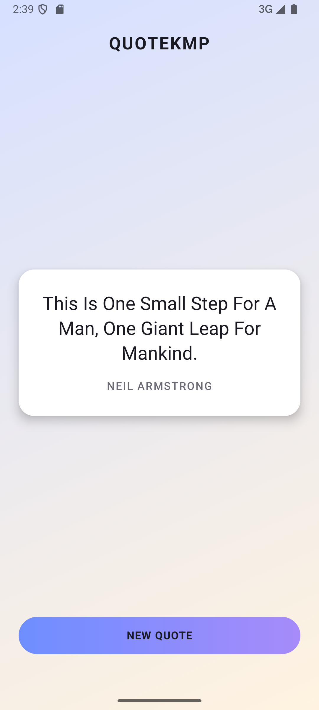

# QuoteKMP

A Kotlin Multiplatform app (Android + iOS) that fetches a random quote from a public API, with offline-first caching.

## Screenshot

## Features

- Fetches a random quote from [dummyjson.com](https://dummyjson.com/quotes/random)
- Caches quotes locally with SQLDelight — the app works fully offline after the first successful fetch
- Falls back to a cached quote when there is no network, with a clear "Offline · cached" indicator
- Shows a clear message when there is no network and no cached quotes yet, instead of spinning forever
- Shared UI built once with Compose Multiplatform, running on both Android and iOS

## Tech stack

- **Kotlin Multiplatform** — shared business logic across Android and iOS
- **Compose Multiplatform** — shared UI
- **Ktor** — HTTP client for fetching quotes
- **SQLDelight** — typed local database, used for offline caching
- **Koin** — dependency injection
- **Kotlin Coroutines / Flow** — asynchronous and reactive state management

## Architecture

- `shared/` — common business logic
  - `network/` — `QuoteApi` interface + Ktor-based implementation
  - `db/` — SQLDelight schema and `DatabaseDriverFactory` (`expect`/`actual` per platform)
  - `repository/` — `QuoteRepository`, combining network and cache with an offline-first fallback
  - `viewmodel/` — `QuoteViewModel`, exposing UI state as `StateFlow`
  - `di/` — Koin modules (common + per-platform)
- `androidApp/` — Android entry point (`Application`, `MainActivity`)
- `iosApp/` — iOS entry point (SwiftUI host for the shared Compose UI)

## Running the app

- **Android:** open the project in Android Studio and run the `androidApp` configuration, or run `./gradlew :androidApp:assembleDebug` in a terminal.
- **iOS:** open `/iosApp` in Xcode and run it from there.

## Running tests

Run `./gradlew :shared:testAndroidHostTest` in a terminal, or use the run button in the IDE's editor gutter.

Covers:
- JSON deserialization of the `Quote` model
- Repository mapping between the local database and the domain model
- ViewModel state for all three refresh outcomes: successful fetch, fallback to a cached quote when offline, and an empty state when there is no network and no cache
- ViewModel ignoring a stale in-flight request when `refresh()` is called again before it completes
